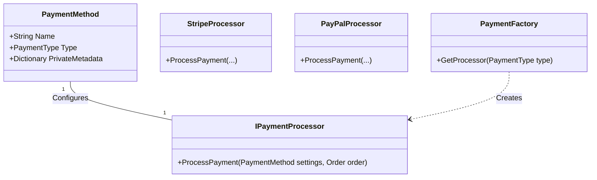

# Payment System Implementation Guide

## 1. Current State Analysis
- **Domain Layer (`ReSys.Core`)**: Contains `PaymentMethod` entity with `Type`, `Status`, and `PrivateMetadata`. This is where settings **should** be stored.
- **Infrastructure Layer (`ReSys.Infrastructure`)**: Currently **missing** the actual payment processing logic (Gateways).
- **Features Layer**: Missing `PaymentMethod` management (CRUD) and Checkout integration.

## 2. Architecture: How it should work
The `PaymentMethod` entity acts as the configuration source. The `Infrastructure` layer uses this configuration to drive specific processors.



## 3. Implementation Steps

### Step 1: Define the Interface
Create `src/libs/ReSys.Core/Domain/Ordering/Payments/Gateways/IPaymentProcessor.cs`:

```csharp
public interface IPaymentProcessor
{
    PaymentMethod.PaymentType Type { get; }
    Task<ErrorOr<PaymentResult>> ProcessPaymentAsync(PaymentMethod settings, Order order, CancellationToken ct);
}
```

### Step 2: Implement a Processor (e.g., Stripe)
Create `src/libs/ReSys.Infrastructure/Payments/Gateways/StripeProcessor.cs`.
**Crucial:** This is how you use the "Current Settings". You read them from `PaymentMethod.PrivateMetadata`.

```csharp
public class StripeProcessor : IPaymentProcessor
{
    public PaymentMethod.PaymentType Type => PaymentMethod.PaymentType.Stripe;

    public async Task<ErrorOr<PaymentResult>> ProcessPaymentAsync(PaymentMethod settings, Order order, CancellationToken ct)
    {
        // 1. Get Settings from the Entity
        if (!settings.PrivateMetadata.TryGetValue("SecretKey", out var secretObj) || secretObj is not string secretKey)
        {
             return Error.Configuration("Stripe.MissingKey", "Stripe Secret Key is not configured.");
        }

        // 2. Use Stripe SDK
        StripeConfiguration.ApiKey = secretKey;
        var options = new PaymentIntentCreateOptions 
        { 
            Amount = order.TotalAmount, 
            Currency = "usd",
            AutomaticPaymentMethods = new PaymentIntentAutomaticPaymentMethodsOptions { Enabled = true }
        };
        
        var service = new PaymentIntentService();
        var intent = await service.CreateAsync(options, cancellationToken: ct);

        return new PaymentResult(intent.Id, PaymentStatus.Pending);
    }
}
```

### Step 3: Implement the Factory
Create `src/libs/ReSys.Infrastructure/Payments/PaymentFactory.cs` to select the right processor.

```csharp
public class PaymentFactory(IEnumerable<IPaymentProcessor> processors)
{
    public ErrorOr<IPaymentProcessor> GetProcessor(PaymentMethod.PaymentType type)
    {
        var processor = processors.FirstOrDefault(p => p.Type == type);
        return processor ?? Error.NotFound("Payment.ProcessorNotFound");
    }
}
```

### Step 4: Register in InfrastructureModule
Update `src/libs/ReSys.Infrastructure/InfrastructureModule.cs`:

```csharp
services.AddScoped<IPaymentProcessor, StripeProcessor>();
services.AddScoped<IPaymentProcessor, PayPalProcessor>();
services.AddScoped<PaymentFactory>();
```

## 4. How to Manage Settings (Admin)
You need to implement the Admin Feature to Create/Update `PaymentMethod` entities.

1.  **UI**: Admin form with fields for `Name`, `Description` AND dynamic fields for `PrivateMetadata` (e.g., if Type=Stripe, show "Secret Key" input).
2.  **Backend**: `UpdatePaymentMethod` command that saves these inputs into `PrivateMetadata`.

**Security Note:** Encrypt sensitive values in `PrivateMetadata` before saving to DB, or use a ValueConverter in EF Core.
